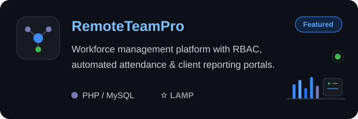
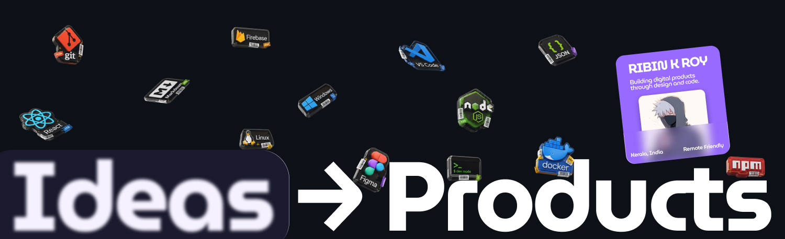

 
  ###  BRAND & PRODUCT DESIGNER • FULL-STACK DEVELOPER • AI/ML ENGINEER

  > Designing and building complete digital experiences — from brand identity and product design to full-stack applications and AI-powered solutions.

  &nbsp;

 

  

  

  

  

  

&nbsp;

---

## About

I work across design and engineering to turn ideas into polished, practical digital products. From shaping the visual direction and user experience to building the software behind it, I focus on creating work that is clear, useful, and built to last.

My approach is straightforward: understand the problem, make thoughtful decisions, and deliver work that holds up in the real world. I value **strong design, reliable engineering, clear communication, and attention to detail** — whether working independently or with a team.

  
  &nbsp;
  
  &nbsp;
  
  &nbsp;
  

---

## Core Engineering Focus

<table
  width="100%"
  style="border-collapse:collapse; border-spacing:0;"
>
  <tr>
    <td width="72%" valign="top">

**Backend &amp; System Design**  
Building production-ready web applications, REST APIs, authentication, business logic, and reliable data systems with a focus on scalability, security, and maintainability.  
`API Development` · `Backend Architecture` · `RBAC` · `Database Design`

**Frontend &amp; Product Engineering**  
Turning product ideas and UI/UX designs into responsive, accessible, and maintainable web experiences with attention to usability, performance, and clean component architecture.  
`React` · `JavaScript` · `UI/UX` · `Design Systems`

**AI, ML &amp; Data Engineering**  
Exploring practical AI/ML applications through data pipelines, computer vision, model integration, and automation — connecting intelligent capabilities with real-world software.  
`Python` · `Machine Learning` · `Computer Vision` · `Data Pipelines`

   </td>

 <td
      width="28%"
      valign="top"
      style="padding:0 !important; margin:0; line-height:0; overflow:hidden;"
    >
      
    </td>
  </tr>
</table>

---

## Featured Projects

<table width="100%">
  <tr>
    <td width="50%" align="center" valign="top">
      
    </td>
    <td width="50%" align="center" valign="top">
      
    </td>
  </tr>
</table>

---

## Tech Stack

- **Frontend:** &nbsp; React • JavaScript • Tailwind CSS
- **Backend:** &nbsp; Node.js • Express.js • PHP
- **Databases:** &nbsp; MongoDB • MySQL
- **DevOps & Tools:** &nbsp; Git • Docker
- **Data & AI:** &nbsp; Python • OpenCV • TensorFlow *(Prototyping)*

---
## Articles

I write about what I build, design, and learn along the way — from
**software development and backend engineering** to **UI/UX, AI, and
practical technology**.

  
  &nbsp;&nbsp;&nbsp;&nbsp;&nbsp;

  
  &nbsp;&nbsp;&nbsp;&nbsp;&nbsp;

  
  &nbsp;&nbsp;&nbsp;&nbsp;&nbsp;

  
  &nbsp;&nbsp;&nbsp;&nbsp;&nbsp;

  

  
    The same articles are published across these platforms.
     
    Follow along for project breakdowns, experiments, ideas, and lessons from building.
  

&nbsp;

---
## Activity

<table>
<tr>
<td width="70%">

</td>

<td width="30%">

</td>
</tr>
</table>

---

## Open Source & Collaboration

- Participated in Hacktoberfest and contributed to open-source projects.
- Earned multiple community contribution badges through Holopin.
- Co-developed **RemoteTeamPro** as a team-based university project, collaborating on feature development, testing, and system integration.

  

---

## Current Focus

- **Building:** Python data pipelines and PostgreSQL-based systems
- **Learning:** Docker, CI/CD, and ML inference patterns
- **Goal:** Cloud-native backend engineering with AI integration
- **Open To:** Full-time roles, internships, and collaborative projects

---

## Collaboration & Work Style

* Prefer async communication, clear documentation, and well-defined responsibilities.
* Enjoy building backend systems and full-stack applications through iterative development.
* Value clean, maintainable code and continuous learning through collaboration and feedback.

---

## Get in Touch

  <a href="mailto:rysontheo@proton.me">Email</a> &nbsp;&nbsp; &nbsp; &nbsp; &nbsp; &nbsp; &nbsp; &nbsp; &nbsp; &nbsp;&nbsp; &nbsp;&nbsp; &nbsp; &nbsp;&nbsp;  &nbsp; &nbsp; &nbsp;&nbsp; &nbsp; &nbsp; &nbsp; &nbsp;&nbsp; &nbsp;  
  <a href="https://www.linkedin.com/in/ribin-k-roy/">LinkedIn</a> &nbsp;&nbsp; &nbsp; &nbsp; &nbsp; &nbsp; &nbsp; &nbsp; &nbsp; &nbsp; &nbsp;&nbsp;&nbsp;  &nbsp; &nbsp; &nbsp;&nbsp; &nbsp;  &nbsp; &nbsp; &nbsp;&nbsp; &nbsp; 
  <a href="https://github.com/Ryson-Theo">GitHub</a> &nbsp;&nbsp; &nbsp; &nbsp; &nbsp; &nbsp; &nbsp; &nbsp; &nbsp; &nbsp; &nbsp; &nbsp;&nbsp; &nbsp;  &nbsp; &nbsp; &nbsp;&nbsp; &nbsp;  &nbsp; &nbsp; &nbsp;&nbsp; &nbsp; 
  <a href="https://linktr.ee/ryson_theo">Portfolio</a>

  

